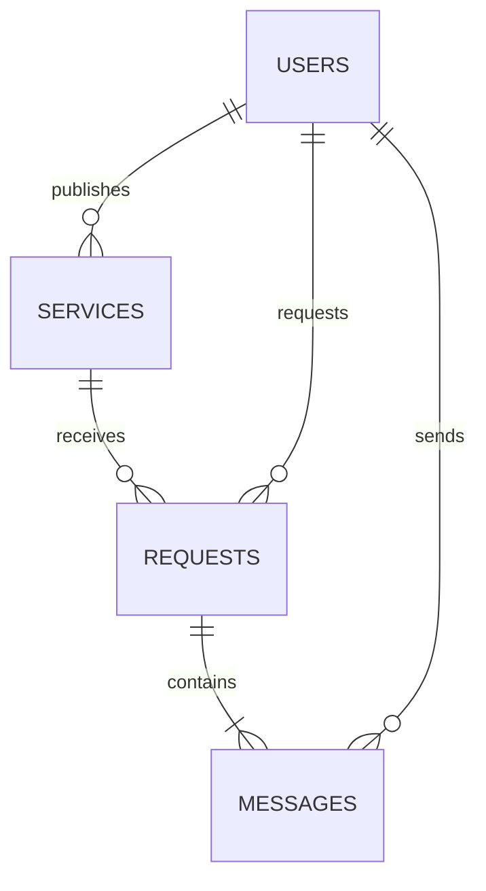

# 🚀 JSM Connect

<p align="center">
  <a href="https://github.com/brayan3210/JSM-Connect">
    
  </a>
</p>

<p align="center">
  <a href="https://deepwiki.com/brayan3210/JSM-Connect"></a>
  <a href="https://github.com/brayan3210/JSM-Connect/actions/workflows/tests.yml"></a>
  <a href="https://packagist.org/packages/brayan3210/jsm-connect"></a>
  <a href="https://github.com/brayan3210/JSM-Connect/blob/main/LICENSE"></a>
</p>

---

## 📝 Índice

1. [Introducción](#introducción)
2. [Características Clave](#características-clave)
3. [Tecnologías y Herramientas](#tecnologías-y-herramientas)
4. [Diagrama de Arquitectura](#diagrama-de-arquitectura)
5. [Modelo de Datos](#modelo-de-datos)
6. [Requisitos y Dependencias](#requisitos-y-dependencias)
7. [Instalación y Despliegue](#instalación-y-despliegue)
8. [Configuración Avanzada](#configuración-avanzada)
9. [Uso y Flujo de Trabajo](#uso-y-flujo-de-trabajo)
10. [API REST](#api-rest)
11. [Mensajería y Notificaciones](#mensajería-y-notificaciones)
12. [Administración y Panel de Control](#administración-y-panel-de-control)
13. [Pruebas y QA](#pruebas-y-qa)
14. [CI/CD y Mantenimiento](#cicd-y-mantenimiento)
15. [Roadmap](#roadmap)
16. [Contribuir](#contribuir)
17. [Soporte](#soporte)
18. [Licencia](#licencia)

---

## 🌟 Introducción

**JSM Connect** es un *marketplace* de servicios robusto y escalable construido en Laravel, diseñado para facilitar el intercambio seguro de servicios entre clientes y proveedores. A través de perfiles completos, flujos de solicitud y mensajería en tiempo real, JSM Connect optimiza la experiencia del usuario al contratar servicios.

Toda la documentación técnica avanzada, diagramas UML y guías de implementación están disponibles en DeepWiki:

👉 [Documentación Oficial](https://deepwiki.com/brayan3210/JSM-Connect)

---

## 🚀 Características Clave

* **Autenticación & Registro**: Soporte para roles (cliente, proveedor, administrador), verificación de correo y recuperación de contraseña.
* **Gestión de Servicios**: CRUD completo de servicios con filtrado por categoría, etiquetas y geolocalización.
* **Flujo de Solicitudes**: Proceso de solicitud, aprobación, cancelación y calificación.
* **Chat Interno**: Mensajería en tiempo real (Pusher/Laravel Echo) entre usuarios.
* **Panel Administrativo**: Dashboards con KPIs, gestión de usuarios, servicios y logs de actividad.
* **Notificaciones**: Email y notificaciones push configurables.
* **Automatización**: Tareas programadas (Laravel Scheduler) para limpieza de datos y recordatorios.
* **API REST**: Endpoints versionados con autenticación via Laravel Sanctum.

---

## 🛠 Tecnologías y Herramientas

| Capa               | Tecnología / Herramienta     |
| ------------------ | ---------------------------- |
| Framework          | Laravel 10                   |
| Lenguaje           | PHP 8.1+                     |
| Plantillas         | Blade + Tailwind CSS         |
| Enriquecimiento JS | Alpine.js                    |
| Base de Datos      | MySQL 8 / PostgreSQL 13      |
| Caching            | Redis                        |
| Colas              | Laravel Queue (Redis Driver) |
| Real-time          | Pusher + Laravel Echo        |
| Testing            | PHPUnit, Pest, Mockery       |
| CI/CD              | GitHub Actions               |
| Documentación      | DeepWiki                     |

---

## 🏗 Diagrama de Arquitectura


> **Figura:** Vista de alto nivel de componentes y flujos de datos. Consulta más diagramas en DeepWiki.

---

## 💾 Modelo de Datos

Principales entidades y relaciones:



* **User**: id, name, email, role, profile
* **Service**: id, title, description, category\_id, provider\_id
* **Category**: id, name, parent\_id
* **Request**: id, service\_id, client\_id, status
* **Message**: id, request\_id, sender\_id, content, read\_at

Para un ER completo, revisa:

👉 [Modelo de Datos Completo](https://deepwiki.com/brayan3210/JSM-Connect#7-Core-Architecture)

---

## ⚙️ Requisitos y Dependencias

* **PHP** >= 8.1
* **Composer** >= 2.0
* **Node.js** >= 16
* **npm** >= 8 / **Yarn** >= 1.22
* **MySQL** 8+ o **PostgreSQL** 13+
* Extensiones PHP:

  * BCMath, Ctype, Fileinfo, JSON, Mbstring, OpenSSL, PDO, Tokenizer, XML

Instala dependencias globales:

```bash
composer global require laravel/installer
npm install -g yarn
```

---

## ⚙️ Instalación y Despliegue

1. **Clonar repositorio**

   ```bash
   ```

git clone [https://github.com/brayan3210/JSM-Connect.git](https://github.com/brayan3210/JSM-Connect.git)
cd JSM-Connect

````
2. **Configurar entorno**
   ```bash
cp .env.example .env
php artisan key:generate
````

3. **Instalar dependencias**

   ```bash
   ```

composer install
npm ci && npm run build

````
4. **Migraciones y Seeders**
   ```bash
php artisan migrate --seed
````

5. **Servidor Local**

   ```bash
   ```

php artisan serve

```
6. **Despliegue**
   - Configura en tu servidor Apache/Nginx
   - Asegúrate de apuntar al folder `public/`
   - Configura tareas cron: `* * * * * php /path/to/artisan schedule:run >> /dev/null 2>&1`

---

## 🔧 Configuración Avanzada

- **Roles & Permisos**: `config/permissions.php`
- **Broadcasting**: `config/broadcasting.php`
- **Queue**: `QUEUE_CONNECTION=redis`
- **Mail**: `MAIL_MAILER=smtp`
- **Custom Services**: Registra en `app/Providers/ServiceProvider`

Más opciones en DeepWiki:
- [Setup & Configuration](https://deepwiki.com/brayan3210/JSM-Connect#6-Project-Setup--Configuration)
- [Middleware Pipeline](https://deepwiki.com/brayan3210/JSM-Connect#8-HTTP-Pipeline--Middleware)

---

## 👨‍💼 Uso y Flujo de Trabajo

### Roles y Acceso
- **Cliente**: Busca y solicita servicios.
- **Proveedor**: Publica servicios y gestiona solicitudes.
- **Administrador**: Monitorea, aprueba y gestiona toda la plataforma.

### Flujo Básico
1. **Registro/Login**: Usuario crea cuenta y verifica email.
2. **Perfil**: Completa datos y, para proveedores, agrega portafolio.
3. **Explorar Servicios**: Filtros avanzados y vista de detalle.
4. **Solicitud**: Cliente solicita; proveedor gestiona.
5. **Chat**: Comunicación en tiempo real hasta cierre.
6. **Calificación**: Cliente y proveedor evalúan al finalizar.

Para más mapas de flujo:
👉 [User & Admin Workflows](https://deepwiki.com/brayan3210/JSM-Connect#11-User-Features)

---

## 📡 API REST

Todos los endpoints usan prefijo `/api/v1` y autenticación con Sanctum.

| Método | Ruta                    | Descripción                      |
| ------ | ----------------------- | -------------------------------- |
| POST   | `/api/v1/register`      | Registrar usuario                |
| POST   | `/api/v1/login`         | Login                            |
| GET    | `/api/v1/services`      | Listar servicios (paginado)      |
| POST   | `/api/v1/services`      | Crear servicio                   |
| GET    | `/api/v1/services/:id`  | Ver detalles de un servicio      |
| POST   | `/api/v1/requests`      | Crear solicitud                  |
| GET    | `/api/v1/requests/:id`  | Ver solicitud y chat             |
| POST   | `/api/v1/requests/:id/messages` | Enviar mensaje            |

Especificación completa:
👉 [API Endpoints](https://deepwiki.com/brayan3210/JSM-Connect#5-API-Endpoints)

---

## 📨 Mensajería y Notificaciones

- **Realtime Chat**: Pusher & Laravel Echo (canales privados).
- **Emails**: Mailable classes para confirmaciones y notificaciones.
- **Broadcast Events**: Definidos en `app/Events`.

Guías:
👉 [Messaging & Events](https://deepwiki.com/brayan3210/JSM-Connect#13-Event-Driven)

---

## 🛡 Administración y Panel de Control

- **Dashboard**: Gráficos de usuarios activos, servicios publicados, solicitudes pendientes.
- **Gestión**: CRUD para usuarios, categorías, servicios y roles.
- **Logs**: Auditoría de acciones en `storage/logs`.

Para más detalle:
👉 [Admin System](https://deepwiki.com/brayan3210/JSM-Connect#16-Administrative-System)

---

## 🧪 Pruebas y QA

- **Unitarias**: `php artisan test --testsuite=Unit`
- **Funcionales**: `php artisan test --testsuite=Feature`
- **Cobertura**: `vendor/bin/phpunit --coverage-text`

Inspecta la guía de testing:
👉 [Testing](https://deepwiki.com/brayan3210/JSM-Connect#20-Testing)

---

## 🔄 CI/CD y Mantenimiento

Configuración de **GitHub Actions**:
- Linting PHP (PHPCS), JS (ESLint)
- Ejecución de tests
- Generación de artefactos
- Despliegue automático en staging/producción

Recomendación:
- Cronjob para `schedule:run`
- Supervisor para procesos de queue

Detalles:
👉 [CI/CD Pipelines](https://deepwiki.com/brayan3210/JSM-Connect#23-CICD)

---

## 📈 Roadmap

- ✅ Soporte para pasarelas de pago
- 🔄 App móvil (React Native)
- 📊 Análisis avanzado y ML
- 🌐 Internacionalización

Contribuye a la planificación:
👉 [Roadmap Issues](https://github.com/brayan3210/JSM-Connect/issues)

---

## 🤝 Contribuir

1. Forkea el repositorio.
2. Crea una rama: `git checkout -b feature/NOMBRE`
3. Commit de tus cambios: `git commit -m "feat: descripción"`
4. Push: `git push origin feature/NOMBRE`
5. Abre un PR y describe los cambios.

Lee las políticas:
👉 [Guía de Contribución](https://deepwiki.com/brayan3210/JSM-Connect#Contributing)
👉 [Código de Conducta](https://deepwiki.com/brayan3210/JSM-Connect#22-Legal--Compliance)

---

## 📬 Soporte

Para soporte técnico y consultas:

- **Email**: support@jsmconnect.com
- **Discord**: [discord.gg/jsmconnect](https://discord.gg/jsmconnect)
- **Issues**: https://github.com/brayan3210/JSM-Connect/issues

---

## 📄 Licencia

Este proyecto se distribuye bajo la **Apache License 2.0**. Consulta [LICENSE](LICENSE) para más detalles.
```
